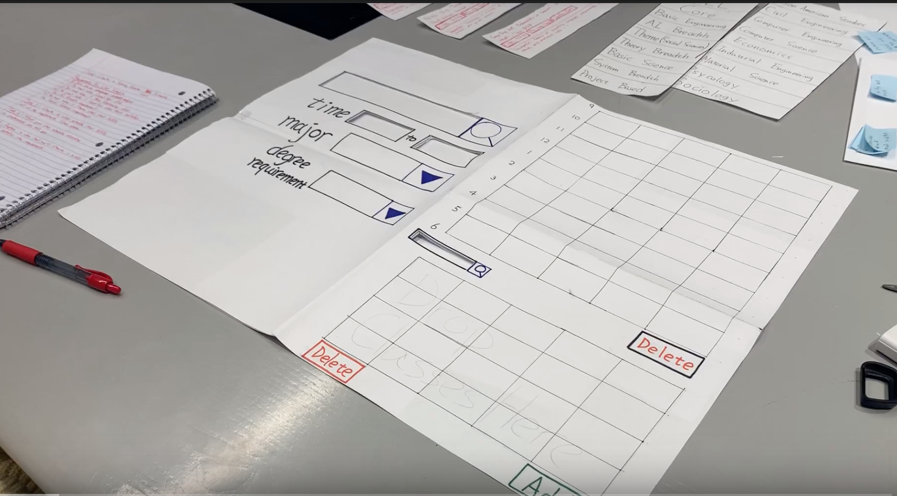

# Course-Selection-Prototype README.md

## 1) Problem & Related Work (P1)

__Problem__

Arranging class schedules and finding specific classes to fit into that schedule have been a significant problem for Northwestern students for many years. 

We identified 2 big problems in the registration process:

1) When choosing a class, students have to manually search which ones are offered. Especially if one doesn’t have a specific class in mind, but rather an idea of which area to take a class from, finding a class from a certain area (i.e. in Humanities Distro Area) that fits one’s requirements and doesn’t overlap with other classes become incredibly time-consuming. 

2) Students never end up actually registering for classes that they planned to take. So even though they spend enough time and create a desirable schedule, most courses end up filling up before their registration time. Often times they have to restart the process by looping back to their first struggle of manually searching for alternative classes. 

__Related Work__ 

_Serif.nu_

Although somewhat different, an alternative of this problem has been tackled by the Northwestern students. They created a website called serif.nu that allows one to pick classes offered only in a quarter and see how they appear in your schedule. With this, one can see if a class overlaps with any other in less than a second.

As you can see here. Serif.nu can easily display whether classes overlap with each other or not. However, it has some shortcomings:

1) One still needs to visit departmental websites to figure out whether courses they plan to take fulfill requirements.

2) One still needs to go to CAESAR to register for courses.

3) Serif.nu doesn't show discussion times of courses nor indicates whether it's open.

4) Serif.nu doesn't display any additional information on courses (e.g description, CTECS, etc.) other than their times.

__The Goal__

After sharing this idea with students with different academic backgrounds, we realized that it is a common issue within all majors. This prevents students to effectively allocate classes among quarters and affects their registration experience negatively. 

Finding a solution that will allow students to adapt to class availability and look up classes an hassle-free way will have a valuable impact on their experience at Northwestern. We believe that a solution will mitigate the academic stress and prevent students from taking courses last-minute that they did not intend to. Thus, students will start their quarter more eagerly. 

## 2) User Research (P2&P3)

__User Population__

Our target user population are full-time Northwestern students. These students are 17 to 30 years old. They are diverse in their school year, level of readiness for class selection. They are also pursuing different combinations of majors, minors, and certificates. Thus, they have different course requirements throughout college. The users are place importance on selection of their optimal schedule and information regarding these classes. The users are moderately tech savvy, proficient in adapting to new websites.

__Research Approach__

Before our research, being Northwestern students as well, we were confident that Northwestern students in general struggled with creating a desirable class schedule based on their requirements (both academic and personal). Because the problem is a task-oriented one and also there could’ve been some difficulties in conveying the problem verbally (e.g the user might not believe the struggles he/she experiences are significant, the user might not be aware of a specific struggle he/she’s facing, etc), we decided to conduct task-oriented contextual inquiries. 

For our research, each group member conducted a task-oriented contextual inquiry with a full-time Northwestern student. 

From the inquiries, we aimed to gain insight on:

- Challenges students face in creating a desirable schedule
- How students deal with specific problems related to choosing classes (i.e schedule conflict, full classes, etc.)
- Tendencies of students in using CAESAR
- Which challenges are the students most annoyed by
- Any tools currently used

For our task-oriented contextual inquiries, we asked students to create class schedules for their next quarter. Whilst creating, we observed them navigating through CAESAR (for selecting classes and putting them in their shopping carts), serif.nu (for visualizing their weekly schedule), and department websites (for figuring out which classes they could take in order to satisfy specific requirements). Furthermore, we occasionally told them that the course they would like to take was now full and that they would have to select another one. We also observed them go to the struggles of removing a class and finding another one that fit their schedules.

__Interview and Observation Notes__

All of the users in our task-oriented inquiries were tasked to create a mock Winter 2020 class schedule because serif.nu and Caesar haven’t been updated for spring courses. We observed 3 users in total (Taylor Reyes, Yerim Lee, and Sena Uzelli). For conciseness, we'll include notes only on Taylor Reyes.

Kerem’s Notes On Taylor Reyes

Academic Track: BME + German minor

- She had to navigate three tabs at once (CAESAR, serif.nu, departmental website).
- Some of the courses she looked up were either not visible on serif.nu or had the wrong time slots.
- Serif.nu didn’t show discussion times, so she had to go on CAESAR solely to learn when were the discussion times are and wrote them on a piece of paper.
- She had to look up each German course she planned to take in both BME and German department’s website to see whether they satisfied requirements.
- When navigating through tabs, she often forgot what she was looking for, so she had to go back to the previous tab.
- She clicked on the browser’s back button way too many times which refreshes the CAESAR search. 
- Every time she wanted to choose a class, she had to go back to its respective departmental website and check which requirements did it satisfy.
- Every time she chose a class on serif.nu, she had to go back on CAESAR to see which pre-reqs the class had.

The process took ~1 hour. ~30 mins for creating the initial schedule and ~30 mins for replacing two classes (she chose the first class in ~10 mins, the other one in ~20 mins)

__Observation Summary__

Through our observations, We saw that they are aware of the difficulty of the process, and all verbally confirmed that they struggle almost every time. We realized that everyone has a different method to create a schedule, which was more than expected. Each had a different way to coup with all the information and unforeseen obstacles on the way. For instance, one of them created alternative plans if several classes fill up. 

We identified several user needs. First, they need to easily navigate through the course descriptions between different departments. On each course site, they want to see the prerequisites of each course. On a different site, they needed to see the degree requirements for their major. Opening a separate webpage for each set of information was tedious for them. Secondly, they want to easily keep track of the meeting times and prerequisites to be easily accessed while transferring between tabs. The selection of new classes came in the order of looking at degree requirement, then sorting through class prerequisites, lastly checking ctecs and timing.

Almost all the students we observed had a painful process navigating through multiple tabs and often forgot an information on a course and had to go back and check again. Most of the participants used a helper notepad, or a piece of paper, aside to not forget all the overwhelming information coming at once. The most time-consuming part of the process was to check-out each course in a separate tab to see the requirements, weekly hours, and the description. They are not satisfied with what Caesar has to offer because it is either to layered out or slow to navigate. This is the obstacle that pushes users into the habit of working in multiple tabs, making the process more complex at some point. Either using Caesar, or using outside sources such as department websites, we realized that the users were unhappy about how the information is all over the place and not collected under one source. This confirmed our initial belief that there is an opportunity for innovation in unifying the information and allowing users to easily sort through the necessary resources on one page.

## 3) Paper Prototype (P4)

[Link to the Paper Prototype Testing Video](https://youtu.be/514ZeWnftEw)

We tested our paper prototype with three different users. The overall feedback on the concept was very positive: they all expressed their opinions that we needed a more advanced platform for course-selection process. The initial layout of our prototype only included one area including all filters,and another area that included Shopping Cart and Weekly Schedule, which can be seen on the picture below. Users said that the concept is useful because there are currently no other way of searching for courses with such in-debth filters. They also stated that this product merges functionalities of CAESAR and Serif.nu, and adds useful advance filtering. 

Below are the main usability problems we encountered during the paper prototype testing, and how we approached to fix them for later prototypes.

__Problem 1__

This layout confused most of our users mainly because they didn't understand whether they should choose their own major, or the major that the course they are searching for belongs to. It was unclear for them that 'Degree Requirement' filter is meant to filter courses according to that user's major's degree requirements. So if one wanted to use that filter, he/she must have choosed their major first. So the 'Major' filter can be used for two purposes: 

- If a CS major student wants to take an Econ class, he/she can filter courses by 'Major = Econ'.
- If a CS major student wants to take a Basic Engineering course, which is a CS major requirement, he/she can filter 'Major = CS' and use the 'Degree Requirement = Basic Engineering'. 

Having two different usability options for the 'Major' filter created a huge problem because testers were unsure whether to put their own major there, or the major of the course that they wanted to search. To address this issue, we decided to change from having a single page with all filters, to two different tabs seperated as 'Select by Class' and 'Select by Major'.

__Problem 2__

Another usability problem that we observed was that users were reluctant to use the search sign indicated right next to the search bar, especially when they searched for courses without explicitly typing them in the search bar. So, for instance, when users searched for a CS class based on the academic requirement, using only the 'Major' and 'Degree Requirement' filters, they alway forgot to press the search sign that is next to the emtpy search bar. 

We realized that having a search sign adjacent to the search bar misguided users. To fix this problem, we created a 'Submit' button at the very below of the filters page and made it big enough to be recognizable. 

__Problem 3__

Our initial paper prototype was designed such that if a user wanted to add a class to the shopping cart, he/she had to drag and drop it into the shopping cart. Then, there were 3 different buttons: one to add a course to the schedule, one to remove from the schedule, and one to remove from the shopping cart. Users had hard times with this system: They didn't understand that they should drag & drop a class to add it to the shopping cart. Moreover, having three buttons in the same grid area for different purposes confused them. 

To fix this issue, we replaced the drag & drop functionality with 'Add to Shopping Cart' button next to each course in the list. Additionally, we put the options to remove from shopping cart, add to schedule, or remove from schedule inside a pop-up that appears only when a user clicks on the course item itself. 

__Problem 4__

Lastly, we observed that none of the users used the 'Time' filter and they said that it wasn't as useful and when we asked if any filters are missing, they suggested that it would be good to have a 'Course Number' filter just like what CAESAR currently has. 

Taking their suggestion into consideration, we included a 'Course Number' filter and got rid of the 'Time' filter for our upcoming prototypes. 

## 4) High Fidelity Prototyping (P5, P6, P7)

We decided to support the looking up degree requirements for majors, referencing descriptions and prerequisites, checking timing and most importantly easy cross referencing and navigation between these information.

__Degree Requirements__

To support looking up degree requirements for majors, we implemented a class search based on major and academic requirements, a class search based on key words, class department, and course number, and a user profile saving degree information. Since users' degree requirement is crucial to sorting through classes to take, the search by major allows users to directly use that information to look for the right classes. As seen below, computer science majors can search directly for basic engineering classes.

In addition, existing Caeser search was crucial as some users would like to take classes they know of. A search by keyword, department, and number was implemented similarly to Caeser to ease the transition for students, as seen below.

To handle flexibility and improve ease of navigation, both searches are easily switched between with tabs and located on the same side of the same page.

__Course Description and Prerequisites__

To support user evaluation of course descriptions and prerequisites, we integrated them into search results for the courses, popups in the shopping cart, and popups in the schedule.

## 5) Reflection

In the restricted time we had, we managed to create a product, in which students can create potential schedules by selecting courses based on their major's academic requirement, the course number and name, as well as any major that course belongs to. They can easily see how the courses fit in their schedules and remove/add accordingly. Moreover, they can keep potential courses in their Shopping Cart for future reference. 

If we had more time, the next steps would include a more in-debth user profile where we track a student's academic record and potentially list courses accordingly, i.e. not showing courses he/she already took, or eliminating the courses which have prerequisites that the student does not meet of. 

We can potentially work on suggesting personalized courses for students, and create tiers in the Shopping Cart for students to list their most desired, second option, third option alternatives for a certain course. 

## 6) Links

The team's repo:
https://github.com/cs330section66/course-selection-prototype

Working version of prototype:
https://cs330section66.github.io/course-selection-prototype/

Instructions for running the app:
similar to P3 and stuff!!!
